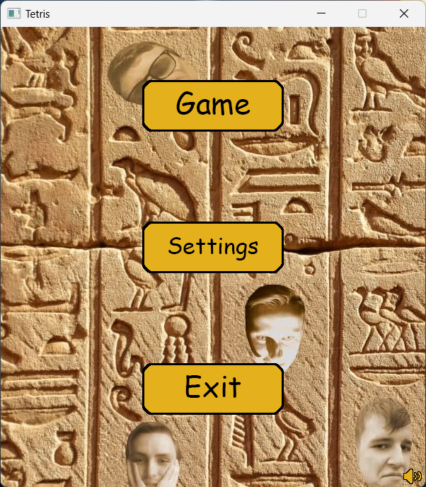
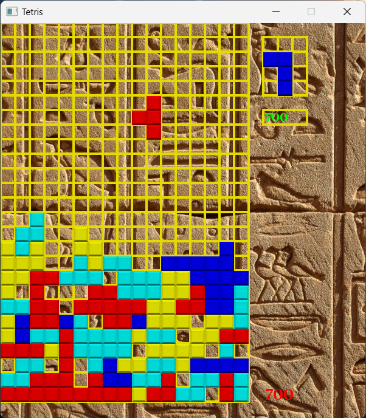

# Tetris

Цей проект - гра у жанрі пазлів, яка поєднує в собі елементи головоломки та стратегії. Гра базується на класичній версії Tetris.

## Опис

Tetris - це 2D відеогра у жанрі пазлів, яка є поєднанням елементів головоломки та стратегії. Гравець має за завдання розташовувати падаючі фігури у такий спосіб, щоб заповнити ряди по всій ширині ігрового поля, щоб вони зникли і зробили місце для нових фігур.

Гра має графічний інтерфейс та звукові ефекти, які створені з використанням бібліотеки SFML. Також була реалізована система запису рекордів користувачів, що дозволяє змагатися з друзями за кращий результат.

## Засоби та технології

- **C++**: Мова програмування, в якій був реалізований код гри.
- **SFML (Simple and Fast Multimedia Library)**: Бібліотека, яка використовувалася для створення графіки та звукових ефектів.
- **CMake**: Інструмент для автоматизації процесу збірки проекту.

## Музичний супровід

Музичний супровід гри Tetris створює атмосферу гри та додає до враження від геймплею. Звукові ефекти та музика можуть бути відрегульовані в налаштуваннях гри.

## Встановлення та запуск

### Встановлення за допомогою .exe

Для встановлення та запуску гри, завантажте відповідний інсталятор за наступним шляхом:

- [Tetris_x86.exe](https://github.com/Rodtzdream/Tetris/tree/main/bin)

Після завершення встановлення, ви можете запустити гру зі створеного ярлика на робочому столі або в меню "Пуск".

### Збірка за допомогою CMake

Для збірки вихідних кодів проекту за допомогою CMake, виконайте наступні кроки:

1. **Відкрийте термінал та перейдіть до кореневої директорії проекту.**
2. **Створіть директорію для збірки:**

```bash
mkdir build && cd build
```

3. **Налаштуйте збірку за допомогою CMake:**

```bash
cmake ..
```

4. **Виконайте збірку:**

```bash
cmake --build .
```

5. **Після успішної збірки ви можете запустити гру зі створеної вихідної директорії:** `build/bin`

## Скріншоти гри

### Головне меню гри



### Процес гри



## Автор

**Олійник Юрій**

- Пошта: <olijnikura@gmail.com>
- Телеграм: [@rodtzdream](https://t.me/rodtzdream)

## Підтримка

Якщо у вас є які-небудь питання або пропозиції щодо цього проекту, не соромтеся зв'язатися зі мною.

## Ліцензія

Цей проект є опенсорсним, що означає, що ви можете вільно використовувати, модифікувати та розповсюджувати його в межах умов ліцензії. Детальну інформацію можна знайти у файлі README.md або шляхом звернення до автора.
