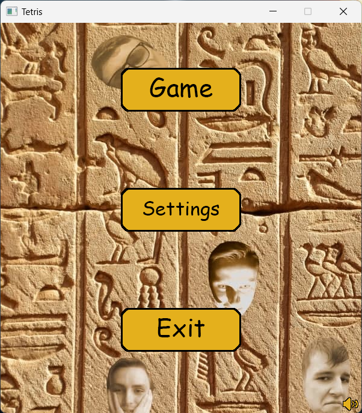
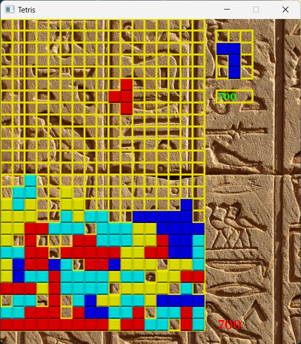

# Tetris

Цей проект - гра у жанрі пазлів, яка поєднує в собі елементи головоломки та стратегії. Гра базується на класичній версії Tetris.

## Опис

Tetris - це 2D відеогра у жанрі пазлів, яка є поєднанням елементів головоломки та стратегії. Гравець має за завдання розташовувати падаючі фігури у такий спосіб, щоб заповнити ряди по всій ширині ігрового поля, щоб вони зникли і зробили місце для нових фігур. 

Гра має графічний інтерфейс та звукові ефекти, які створені з використанням бібліотеки SFML. Також була реалізована система запису рекордів користувачів, що дозволяє змагатися з друзями за кращий результат.

## Засоби та технології

- **C++**: Мова програмування, в якій був реалізований код гри.
- **SFML (Simple and Fast Multimedia Library)**: Бібліотека, яка використовувалася для створення графіки та звукових ефектів.

## Музичний супровід

Музичний супровід гри Tetris створює атмосферу гри та додає до враження від геймплею. Звукові ефекти та музика можуть бути відрегульовані в налаштуваннях гри.

## Встановлення та запуск

Для встановлення та запуску гри, завантажте інсталятор за наступним шляхом: [Tetris.exe](https://github.com/Rodtzdream/Tetris/tree/main/setupFile), і встановіть його на ваш комп'ютер. Після встановлення, на робочому столі або в меню "Пуск" буде створено ярлик для запуску гри. Просто відкрийте цей ярлик для початку гри.

## Скріншоти гри

Вище наведені скріншоти інтерфейсу гри Tetris:

Головне меню гри

Процес гри

## Автор

**Олійник Юрій**

- Пошта: olijnikura@gmail.com
- Телеграм: [@rodtzdream](https://t.me/rodtzdream)

Якщо у вас є які-небудь питання або пропозиції щодо цього проекту, не соромтеся зв'язатися зі мною.

## Ліцензія

Цей проект є опенсорсним, що означає, що ви можете вільно використовувати, модифікувати та розповсюджувати його в межах умов ліцензії. Детальну інформацію можна знайти у файлі README.md або шляхом звернення до автора.
